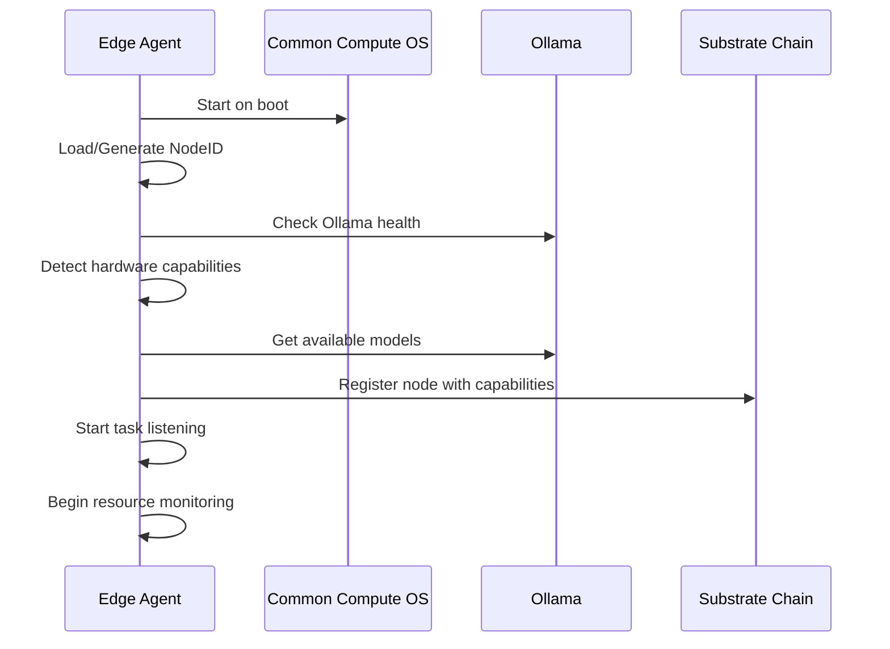
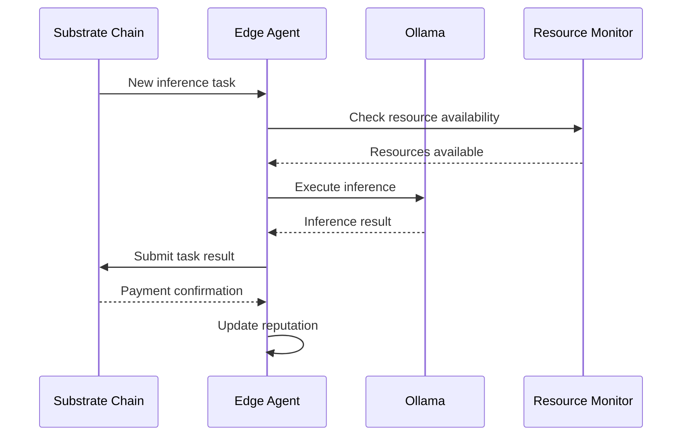
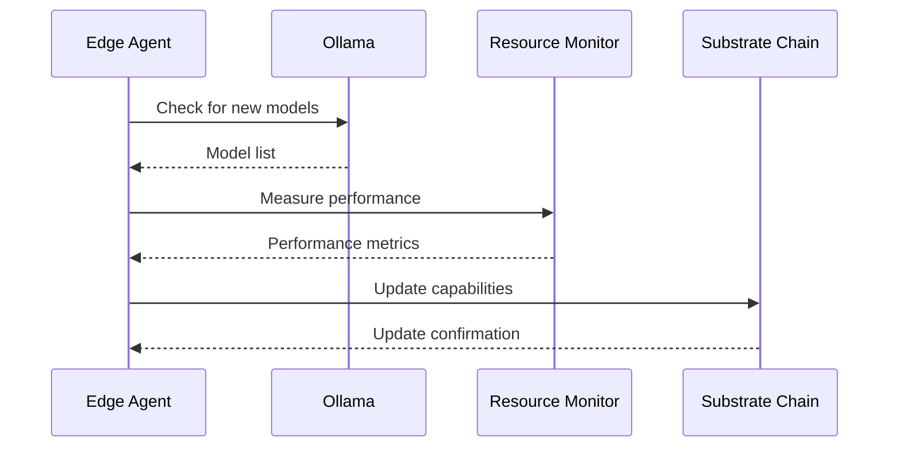

# Edge Agent Design: Go Agent for Common Compute OS

## 🎯 Objective
Design and implement a Go-based edge agent that runs on Common Compute OS devices to enable them to participate in the decentralized AI inference network by interfacing with both Ollama and the Substrate blockchain.

## 📋 Requirements

### Functional Requirements
- **Automatic Network Registration**: Self-register with blockchain on first boot
- **Ollama Integration**: Seamlessly interface with local Ollama instance
- **Resource Monitoring**: Track and report device capabilities and performance
- **Task Execution**: Accept and execute AI inference tasks from the network
- **Result Submission**: Submit inference results back to blockchain
- **Reward Claiming**: Automatically claim earned tokens

### Non-Functional Requirements
- **Lightweight**: Minimal resource footprint on edge devices
- **Resilient**: Handle network disconnections and blockchain issues gracefully
- **Secure**: Protect device and user data
- **Observable**: Comprehensive logging and monitoring
- **Updatable**: Support automatic updates and configuration changes

## 🏗️ Architecture Overview

```
┌─────────────────────────────────────────────────────────────────┐
│                    Common Compute OS                           │
├─────────────────────────────────────────────────────────────────┤
│  System Services Layer                                         │
│  ├── ollama.service          ├── avahi-daemon.service          │
│  ├── edge-agent.service      ├── coco-web-ui.service           │
│  └── coco-wifi-manager       └── system monitoring             │
├─────────────────────────────────────────────────────────────────┤
│  Go Edge Agent (NEW)                                           │
│  ├── Substrate Client        ├── Ollama Client                 │
│  ├── Resource Monitor        ├── Task Executor                 │
│  ├── Network Manager         ├── Crypto Wallet                │
│  └── Configuration Manager   └── Health Monitor                │
├─────────────────────────────────────────────────────────────────┤
│  Ollama Runtime (Existing)                                     │
│  ├── Model Management        ├── Inference Engine              │
│  ├── API Server (11434)      ├── Resource Management           │
│  └── Model Storage           └── Performance Monitoring        │
└─────────────────────────────────────────────────────────────────┘
```

## 🔧 Component Design

### 1. Main Edge Agent (`cmd/edge-agent/main.go`)

```go
type EdgeAgent struct {
    config          *Config
    substrateClient *substrate.Client
    ollamaClient    *ollama.Client
    resourceMonitor *ResourceMonitor
    taskExecutor    *TaskExecutor
    networkManager  *NetworkManager
    healthMonitor   *HealthMonitor
    
    // State
    nodeID          string
    capabilities    []ModelCapability
    isRegistered    bool
    lastHeartbeat   time.Time
}

func (ea *EdgeAgent) Start(ctx context.Context) error {
    // 1. Initialize all components
    // 2. Register with network
    // 3. Start background services
    // 4. Listen for tasks
    // 5. Periodic maintenance
}
```

### 2. Substrate Integration (`internal/substrate/`)

```go
type SubstrateClient struct {
    api       *gsrpc.SubstrateAPI
    keyring   *signature.KeyringPair
    nodeID    string
    connected bool
}

func (sc *SubstrateClient) RegisterNode(ctx context.Context, info NodeRegistrationInfo) error
func (sc *SubstrateClient) UpdateCapabilities(ctx context.Context, caps []ModelCapability) error
func (sc *SubstrateClient) ListenForTasks(ctx context.Context) (<-chan InferenceTask, error)
func (sc *SubstrateClient) SubmitResult(ctx context.Context, result TaskResult) error
func (sc *SubstrateClient) ClaimRewards(ctx context.Context) error
```

### 3. Ollama Integration (`internal/ollama/`)

```go
type OllamaClient struct {
    baseURL string
    client  *http.Client
}

func (oc *OllamaClient) GetModels() ([]ModelInfo, error)
func (oc *OllamaClient) PullModel(ctx context.Context, modelName string) error
func (oc *OllamaClient) Generate(ctx context.Context, req GenerateRequest) (*GenerateResponse, error)
func (oc *OllamaClient) GetModelInfo(modelName string) (*ModelInfo, error)
func (oc *OllamaClient) IsHealthy() bool
```

### 4. Resource Monitoring (`internal/monitoring/`)

```go
type ResourceMonitor struct {
    collector   *ResourceCollector
    history     *RingBuffer
    alerts      chan Alert
}

type ResourceMetrics struct {
    CPUUsage         float64   `json:"cpu_usage"`
    MemoryUsage      float64   `json:"memory_usage"`
    DiskUsage        float64   `json:"disk_usage"`
    NetworkBandwidth float64   `json:"network_bandwidth"`
    Temperature      float64   `json:"temperature"`
    Timestamp        time.Time `json:"timestamp"`
}

func (rm *ResourceMonitor) GetCurrentMetrics() ResourceMetrics
func (rm *ResourceMonitor) GetCapabilities() []ModelCapability
func (rm *ResourceMonitor) IsAvailable() bool
```

### 5. Task Execution (`internal/execution/`)

```go
type TaskExecutor struct {
    ollamaClient    *ollama.Client
    resourceMonitor *ResourceMonitor
    activeTask      *InferenceTask
    taskHistory     []TaskResult
}

func (te *TaskExecutor) CanExecuteTask(task InferenceTask) bool
func (te *TaskExecutor) ExecuteTask(ctx context.Context, task InferenceTask) (*TaskResult, error)
func (te *TaskExecutor) GetStatus() ExecutionStatus
```

## 📦 File Structure

```
cmd/edge-agent/
├── main.go                 # Main application entry point
├── config.go              # Configuration management
└── agent.go               # Core agent implementation

internal/
├── substrate/              # Blockchain integration
│   ├── client.go          # Substrate client
│   ├── types.go           # Data types
│   └── events.go          # Event handling
├── ollama/                 # Ollama integration
│   ├── client.go          # Ollama API client
│   ├── models.go          # Model management
│   └── health.go          # Health checking
├── monitoring/             # Resource monitoring
│   ├── collector.go       # Metrics collection
│   ├── capabilities.go    # Capability detection
│   └── alerts.go          # Alert handling
├── execution/              # Task execution
│   ├── executor.go        # Task executor
│   ├── queue.go           # Task queue management
│   └── results.go         # Result handling
├── network/                # Network management
│   ├── manager.go         # Network operations
│   ├── discovery.go       # Node discovery
│   └── connectivity.go    # Connection management
├── crypto/                 # Cryptographic operations
│   ├── wallet.go          # Wallet management
│   ├── keys.go            # Key management
│   └── signing.go         # Transaction signing
└── health/                 # Health monitoring
    ├── monitor.go         # Health monitor
    ├── checks.go          # Health checks
    └── reporting.go       # Health reporting

configs/
└── edge-agent.toml        # Default configuration

scripts/
├── install.sh             # Installation script
├── update.sh              # Update script
└── uninstall.sh          # Uninstall script
```

## ⚙️ Configuration Management

### Configuration File (`/etc/common-compute/edge-agent.toml`)

```toml
[agent]
node_id = ""                    # Auto-generated if empty
log_level = "info"
data_dir = "/var/lib/common-compute"
update_interval = "5m"

[blockchain]
ws_url = "wss://rpc.polkadot.io"
http_url = "https://rpc.polkadot.io"
keyring_path = "/etc/common-compute/keyring.json"
auto_register = true
stake_amount = "1000"

[ollama]
endpoint = "http://localhost:11434"
health_check_interval = "30s"
model_sync_interval = "1h"
auto_pull_models = true

[monitoring]
resource_check_interval = "10s"
capability_update_interval = "5m"
metrics_retention = "24h"

[execution]
max_concurrent_tasks = 2
task_timeout = "300s"
result_retry_attempts = 3

[networking]
discovery_enabled = true
p2p_port = 30334
max_peers = 50

[rewards]
auto_claim = true
claim_threshold = "100"
claim_interval = "1h"
```

### Environment Variables

```bash
# Override configuration with environment variables
EDGE_AGENT_NODE_ID=
EDGE_AGENT_BLOCKCHAIN_WS_URL=
EDGE_AGENT_OLLAMA_ENDPOINT=
EDGE_AGENT_LOG_LEVEL=debug
```

## 🔄 Operational Workflows

### 1. Initial Registration Workflow



### 2. Task Execution Workflow



### 3. Capability Update Workflow



## 🛠️ Installation and Deployment

### Installation Script (`scripts/install.sh`)

```bash
#!/bin/bash

# Common Compute Edge Agent Installation
set -e

AGENT_VERSION="v1.0.0"
INSTALL_DIR="/usr/local/bin"
CONFIG_DIR="/etc/common-compute"
DATA_DIR="/var/lib/common-compute"
SERVICE_USER="common"

echo "Installing Common Compute Edge Agent ${AGENT_VERSION}..."

# Download and install binary
wget -O "${INSTALL_DIR}/edge-agent" \
  "https://releases.common-compute.org/edge-agent-${AGENT_VERSION}-linux-arm64"
chmod +x "${INSTALL_DIR}/edge-agent"

# Create directories
mkdir -p "${CONFIG_DIR}" "${DATA_DIR}"
chown -R "${SERVICE_USER}:${SERVICE_USER}" "${CONFIG_DIR}" "${DATA_DIR}"

# Install configuration
cp configs/edge-agent.toml "${CONFIG_DIR}/"

# Install systemd service
cat > /etc/systemd/system/edge-agent.service << EOF
[Unit]
Description=Common Compute Edge Agent
After=network.target ollama.service
Wants=ollama.service

[Service]
Type=simple
User=common
ExecStart=/usr/local/bin/edge-agent
WorkingDirectory=/var/lib/common-compute
Restart=always
RestartSec=10
Environment=RUST_LOG=info

[Install]
WantedBy=multi-user.target
EOF

# Enable and start service
systemctl daemon-reload
systemctl enable edge-agent
systemctl start edge-agent

echo "Edge agent installed successfully!"
```

### Integration with Common Compute OS Setup

**Add to `config/Automation_Custom_Script.sh`**:

```bash
# Install Edge Agent
echo "Installing Common Compute Edge Agent..."
if [ -f "/boot/install-edge-agent.sh" ]; then
    chmod +x /boot/install-edge-agent.sh
    /boot/install-edge-agent.sh
    echo "Edge agent installation completed" >> /var/log/coco-setup.log
else
    echo "Edge agent installer not found, skipping..." >> /var/log/coco-setup.log
fi
```

## 🧪 Testing Strategy

### Unit Tests
- Component initialization and configuration
- Substrate client methods
- Ollama client integration
- Resource monitoring accuracy
- Task execution logic

### Integration Tests
- End-to-end task execution
- Network registration and discovery
- Ollama model management
- Blockchain interaction
- Error handling and recovery

### Hardware Tests
- Performance on Raspberry Pi 4 (4GB/8GB)
- Temperature monitoring under load
- Network connectivity edge cases
- Storage and memory usage
- Battery impact (for portable devices)

### Network Tests
- Multi-node task distribution
- Network partition recovery
- Blockchain connection failures
- Ollama service restarts
- System resource exhaustion

## 📊 Monitoring and Observability

### Metrics Collection
```go
type AgentMetrics struct {
    TasksExecuted      int64     `json:"tasks_executed"`
    TasksSuccessful    int64     `json:"tasks_successful"`
    TasksFailed        int64     `json:"tasks_failed"`
    AverageLatency     float64   `json:"average_latency"`
    TokensEarned       *big.Int  `json:"tokens_earned"`
    ReputationScore    float64   `json:"reputation_score"`
    UptimePercentage   float64   `json:"uptime_percentage"`
    LastTaskTimestamp  time.Time `json:"last_task_timestamp"`
}
```

### Health Checks
- Substrate connectivity
- Ollama service health
- Resource utilization
- Disk space availability
- Network connectivity
- Task execution status

### Logging
- Structured logging with JSON format
- Log rotation and retention
- Error tracking and alerting
- Performance metrics logging
- Security event logging

## 🔒 Security Considerations

### Key Management
- Secure key generation on first boot
- Hardware security module integration (if available)
- Key rotation and backup procedures
- Encrypted key storage

### Network Security
- TLS for all external communications
- Certificate validation
- Rate limiting and DDoS protection
- Firewall configuration

### Data Protection
- Input validation and sanitization
- Secure inference result handling
- Local data encryption
- Privacy-preserving computation

### Access Control
- Minimal privilege principle
- Secure service isolation
- User permission management
- Audit trail maintenance

## 📈 Performance Optimization

### Resource Management
- Dynamic resource allocation
- Task prioritization
- Memory pool management
- CPU affinity optimization

### Caching Strategies
- Model caching and preloading
- Result caching for similar tasks
- Network response caching
- Configuration caching

### Network Optimization
- Connection pooling
- Request batching
- Compression for large payloads
- Adaptive retry strategies

## 🔄 Update and Maintenance

### Automatic Updates
- Version checking and notification
- Safe update procedures
- Rollback capabilities
- Configuration migration

### Maintenance Tasks
- Log cleanup and rotation
- Model cache management
- Performance optimization
- Security patch application

### Monitoring and Alerts
- Performance degradation detection
- Error rate monitoring
- Resource exhaustion warnings
- Security incident alerts

---

**Edge Agent Success**: Seamlessly integrate Common Compute OS devices into the decentralized network while maintaining the existing user experience and adding token earning capabilities.
